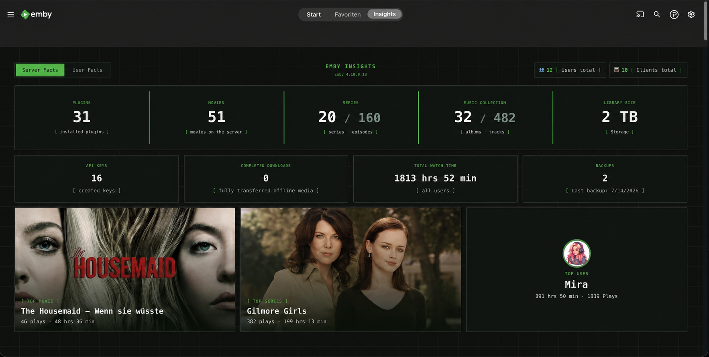
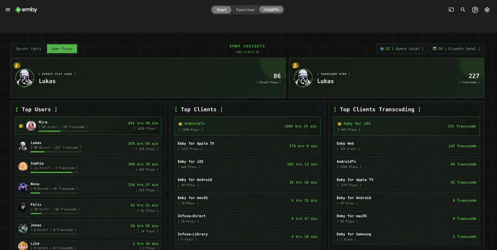

# Emby Insights

Emby Insights gives you a clear view of what is stored on your Emby server and
how it is being used. It adds a dedicated **Insights tab directly to the home
screen**, visible only to administrators.

> **Note:** Emby Insights is currently in beta.

*Server Facts: media collection, storage usage, plugins, backups, and popular titles.*

*User Facts: watch time, top users, frequently used clients, and transcoding activity.*

## What does Emby Insights show?

- movies, series, episodes, albums, and music tracks
- storage usage, installed plugins, and backups
- total watch time and popular titles
- active users and frequently used clients
- Direct Plays and transcodes

The settings page lets you choose which Emby libraries are included and which of
the two available designs is used.

## Requirements

- Emby Server **Stable or Beta**
- the Emby plugin **Playback Reporting** for usage statistics
- an Emby administrator account

Server and media facts come directly from Emby. Watch time, top titles, user
rankings, and client statistics are read from Playback Reporting. Its database is
accessed **read-only** and is never modified.

Without Playback Reporting, server and media facts remain available, but usage
statistics cannot currently be displayed.

## Installation

1. Download `EmbyInsights.Plugin.dll` from the latest GitHub release.
2. Copy the file into your Emby Server plugin directory.
3. Restart Emby Server.
4. Sign in as an administrator and open the **Insights** tab on the home screen.

To update the plugin, replace the existing DLL and restart Emby. Your Emby and
Playback Reporting data will not be modified.

> **Docker note:** Some Emby containers prevent plugins from changing the web
> client. In that case, Emby Insights appears under installed plugins, but the
> Insights home-screen tab may be missing. Please open an
> [issue](https://github.com/mrt187/EmbyInsights/issues) and include your Emby
> version and installation type.

## Privacy

Emby Insights does not currently create its own statistics database. It only reads
the data required for the dashboard from Emby and Playback Reporting. The Insights
tab and its API endpoints are restricted to administrators.

## Problems and feature requests

Emby Insights is a beta project. If something does not work or you would like to
suggest a feature, please open a
[GitHub issue](https://github.com/mrt187/EmbyInsights/issues).

Native data collection planned for a future version is described in the
[roadmap](ROADMAP.md).

## License

Emby Insights is available under the [MIT License](LICENSE). You may use, modify,
and redistribute the plugin. Information about bundled components is available in
[Third-Party Notices](THIRD-PARTY-NOTICES.md).

## Development note

AI-assisted tools were used during development and code review.
